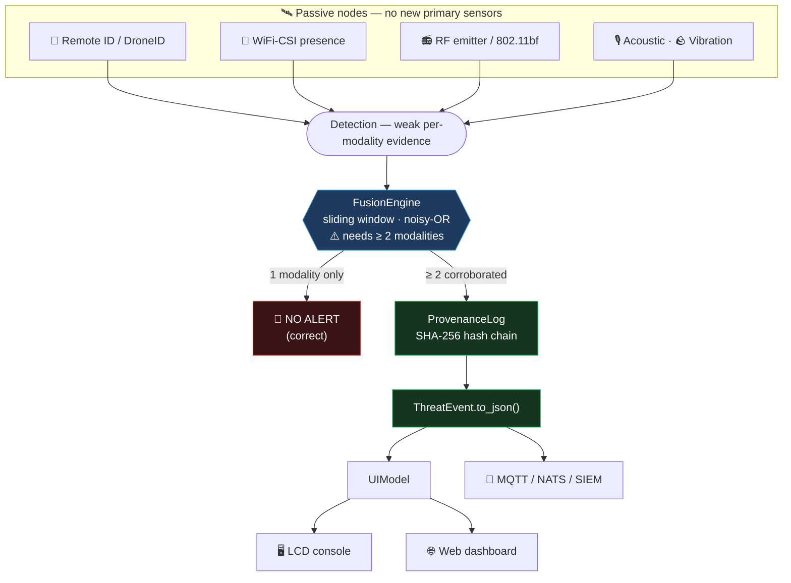

<div align="center">

# ⛈️ RudeStorm

**Passive RF sensing and wireless-airspace defense on hardware you already own.**

Turn the WiFi already in the air into a corroborated, privacy-clean sensor —
on a Raspberry Pi, an ESP32, or an M5 Cardputer.

[](https://opensource.org/licenses/MIT)
[](https://www.python.org/)
[](#-development)
[](#-firmware)
[](#-what-this-is)

</div>

---

## 🌩️ What this is

Every security control you own assumes an attack begins as **bits** — a packet, a
process, an auth event. The expensive ones begin as **physics**: someone walks
into the room, a hotspot bridges an air gap, a drone lands on the roof.

RudeStorm reads the physics. It rides the wireless fabric a building already has,
adds $9–15 passive listeners where there is a gap, and turns weak individually
unreliable signals into events an operator can act on.

It deploys **no new primary sensors** and it **transmits nothing**.

> We don't sell you sensors. We turn the room you already have into one.

<div align="center">

```
  Pi 4B  (ST7735S 128x128)   [CLEAR]  RudeStorm > Physical
  +------------------------------+
  |> Breathing rate       locked |
  |  Fall detection       locked |
  |  Heart rate           locked |
  |  Motion / activity        on |
  |  Presence                 on |
  +------------------------------+

  Pi Zero 2W (same HAT)      [CLEAR]  RudeStorm > Physical
  +------------------------------+
  |> Breathing rate       n/a hw |
  |  Fall detection       n/a hw |
  |  Heart rate           n/a hw |
  |  Motion / activity    n/a hw |
  |  Presence             n/a hw |
  +------------------------------+
```

*Same code, same screen, two boards. Nothing pretends to work.*

</div>

---

## ⚡ The one rule that matters

**No single passive modality raises an alert.**

A high-priority event requires **≥ 2 independent modalities corroborated inside
one time window**. Acoustic and vibration can support an event but never stand
one up alone. Network telemetry is corroboration-only too, for a different
reason: a DHCP lease or a host agent can be forged by the very adversary you are
hunting.

This is the false-alarm story, and false alarms are the documented #1 reason RF
detection products get ripped back out of buildings.

---

## 🛡️ Why this is different

Three things no comparable project does.

### 1. The interface cannot lie about the hardware

Every capability declares what silicon it needs. A node that lacks it **refuses
to load the module and says why** — see the two screens above. There is no
degraded mode that quietly reports confident nonsense.

Concretely: the Pi Zero 2 W's CYW43438 is **not** a Nexmon-supported chip, so it
cannot do CSI. Most projects ship a "works on Pi Zero" claim anyway. Here it is a
load-time failure with the reason attached.

### 2. Privacy is a load-time gate, not a promise

Every module declares the most invasive class of data it can produce:

| Class | Meaning | Default |
|---|---|---|
| `none` | RF metadata only — no humans in the output | ✅ loads |
| `coarse_presence` | "someone is in this zone" — no count, pose, identity | ✅ loads |
| `identity` | device or person fingerprinting | 🔒 refused |
| `biometric` | vitals, pose, gait | 🔒 refused |

Anything above `coarse_presence` is **refused until explicitly unlocked with an
authorization reference**, and the unlock is written into the tamper-evident
chain. "We do not infer identity" stops being a README claim and becomes a
failing code path.

```python
registry.load(HeartRateCog, source_id="node-01")
# rejected: privacy class 'biometric' exceeds node ceiling 'coarse_presence'

registry.unlock_privacy_class(PrivacyClass.BIOMETRIC, authorization="CHG-4471")
registry.load(HeartRateCog, source_id="node-01")   # loads — and both acts are logged
```

### 3. Custody survives the handoff

A Cardputer logs to SD while offline. When it syncs, the Pi verifies that log
using **the same code path it uses for its own records** — the SHA-256 hash chain
is byte-identical across C firmware and Python middleware, and a test compiles
the firmware and proves it on every run.

Making that true forced two permanent constraints, stated plainly because they
will bite anyone extending this:

- **No floats in the chain, ever.** Python renders floats with `repr()`, whose
  shortest-round-trip algorithm is not reproducible in portable C. A confidence
  of `0.734` travels as `confidence_milli: 734`.
- **ASCII only.** Python defaults to `ensure_ascii=True`; non-ASCII is rejected
  at insert time rather than silently forking the chain.

---

## 🔩 Hardware

You do not need all of it. Start with whatever is in your drawer.

| Tier | Board | ~Cost | CSI | Monitor mode | Role |
|---|---|---|---|---|---|
| 🧠 Brain | **Pi 5** | $80 | ✅ | ✅ | Fusion, provenance, web console |
| ⭐ Sensor | **Pi 4B** | $35 | ✅ | ✅ | **Best value** — bcm43455c0 is Nexmon's best-supported chip |
| 📟 Handheld | **M5 Cardputer ADV** | $60 | ✅ | ✅ | Standalone: screen, keyboard, IMU, mic, 1750 mAh |
| 🪶 Cheap node | **Pi Zero 2 W** | $15 | ❌ | ⚠️ | RF/WIDS + BLE + acoustic only |
| 🐜 Mote | **ESP32-S3** | $9 | ✅ | ✅ | Cheapest CSI + Remote ID listener |

**Display (optional, RaspyJack-compatible):** Waveshare 1.44" LCD HAT (ST7735S,
128×128, joystick + KEY1/2/3) or the 1.3" ST7789 240×240. Auto-scaled — layout is
authored once and mapped to whichever panel is attached.

> ⚠️ **The Pi Zero 2 W cannot do CSI.** Its CYW43438 is not on Nexmon's supported
> chip list (bcm4339, bcm43455c0, bcm4358, bcm4365/4366c0). It is a fine packet
> and BLE node. If you want presence, motion, or breathing on one cheap board,
> buy the **Pi 4B** — and pair it with a USB adapter for reliable monitor mode.

---

## 🚀 Quickstart

```bash
git clone https://github.com/P1rate5ec/RudeStorm.git
cd RudeStorm
pip install -r requirements.txt
python -m rudestorm.demo        # three synthetic scenarios, end to end
pytest -q                       # 87 tests
```

The demo shows the two behaviors that matter: a lone drone-like sound produces
**no alert**, and corroborated modalities produce a signed, geolocated event.

### Run the console

```python
from rudestorm.cogs import PI_4B, CogRegistry
from rudestorm.cogs.catalog import STARTER_CATALOG
from rudestorm.ui import UIModel, Action, build_scene, PANELS

registry = CogRegistry(PI_4B)
registry.load_all(STARTER_CATALOG, source_id="node-01")

ui = UIModel(registry)
ui.dispatch(Action.DOWN)
scene = build_scene(ui, *PANELS["st7735s"])   # 128x128, ready to blit
```

On a Pi with the Waveshare HAT attached, `rudestorm.ui.waveshare.run_console`
drives it straight from the joystick.

---

## 🧩 Capabilities

Modules ("cogs") are capability-gated and privacy-classed. **Status is honest** —
a stub loads, gates, and appears in the menu, but emits nothing until its detector
is wired to hardware. It will never fabricate a reading.

### Physical sensing

| Cog | Method | Status | Privacy |
|---|---|---|---|
| Breathing rate | 0.1–0.5 Hz bandpass on sanitized CSI phase, circular-variance gated, zero-crossing BPM · **6–30 BPM** | ✅ implemented | `biometric` |
| Heart rate | 0.8–2.0 Hz bandpass, zero-crossing BPM · **48–120 BPM** | ✅ implemented | `biometric` |
| Presence | Phase-variance fallback + model-backed head | 🚧 stub | `coarse_presence` |
| Motion / activity | Motion-band power + phase acceleration | 🚧 stub | `coarse_presence` |
| Fall detection | Phase acceleration, 3-frame debounce, 5 s cooldown | 🚧 stub | `biometric` |

### Wireless airspace defense

| Cog | Method | Status | ATT&CK |
|---|---|---|---|
| Rogue AP / evil twin | Beacon fingerprinting vs. an authorized baseline | 🚧 stub | T1557, T1200 |
| Deauth / disassoc flood | Management-frame rate anomaly | 🚧 stub | T1498 |
| **Unauthorized 802.11bf** | Detects sensing-measurement solicitation — someone turning your building into a sensor | 🚧 stub | — |
| **CSI poisoning / replay** | Flags injected CSI trying to blind your own detections | 🚧 stub | — |
| Drone Remote ID | Passive ASTM F3411 / DJI DroneID decode | 🚧 stub (adapter exists) | — |

### Platform

| Cog | Purpose | Status |
|---|---|---|
| Provenance chain | SHA-256, tamper-evident, cross-verified C ↔ Python | ✅ implemented |
| Witness chain | Ed25519 over the chain head — attributable, not just tamper-evident | 🚧 stub |
| Mesh sync | Delta-sync detections between field nodes and the brain | 🚧 stub |

<details>
<summary><b>Why the 802.11bf cogs matter</b> — click to expand</summary>

<br>

IEEE finalized **802.11bf** in 2025. WLAN sensing is now a first-class standard
feature, and by 2027–28 every enterprise access point ships as a through-wall
motion and occupancy sensor, negotiated at the MAC layer.

The working group [declined to add a sensing-signal protection
mechanism](https://pascalpiron.substack.com/p/wifi-sensing-and-the-privacy-fix).
It shipped without one.

So every building acquires an always-on human-occupancy array that nobody
procured and no compliance framework covers — and an attacker who owns the AP
management plane gets building-wide telemetry on where people are, with zero
malware and zero traffic anomaly. There is no "unauthorized sensing session"
alert in any SIEM on earth.

That gap is what these two cogs exist to close.

</details>

---

## 🏗️ Architecture

**One headless UI model, two renderers.** The LCD and the web dashboard are both
pure functions of `UIModel`. Layout is authored in a normalized 0–1000 grid and
scaled to any panel, so navigation and posture logic exist exactly once and the
whole interface is tested without a screen, a browser, or a GPIO pin.



```
cogs/       base · nodes · registry · catalog · vitals     capability + privacy gating
ui/         model · render · theme · waveshare             one model, two renderers
firmware/   lib/rudestorm_core/{sha256,json,provenance}    portable, host-testable C
adapters/   csi_presence · remote_id · acoustic · base     raw signal → Detection
fusion.py · governance.py · events.py · identity.py        the spine
```

---

## 🔧 Firmware

`firmware/lib/rudestorm_core/` is **portable C with no ESP dependencies**, so it
compiles and is tested on your laptop. Only the last mile binds to hardware.

```bash
cc -std=c99 -Wall -Wextra -Werror -Ifirmware/lib/rudestorm_core \
   firmware/test/conformance_main.c firmware/lib/rudestorm_core/*.c -o /tmp/conf && /tmp/conf
```

`tests/test_firmware_conformance.py` runs exactly that and asserts every digest
matches Python's — covering key sorting, string escaping, control characters, and
large negative integers. If the two ever drift, the test fails rather than a field
device silently writing an unverifiable log.

**Cardputer ADV note:** the ESP32-S3FN8 has 8 MB flash but **no PSRAM** — 512 KB
SRAM total. The full 30 s × 100 Hz × 56-subcarrier vitals window (~672 KB) does
not fit, so firmware decimates to ~20 Hz and buffers only the *selected*
subcarrier after a short selection phase (~2.4 KB). Same algorithm, different
memory strategy.

---

## 🎯 Honest limits

Stated up front, because every one of these is something a reviewer would
otherwise catch:

- **Heart rate is 48–120 BPM, not 40–120.** A 0.8 Hz low cutoff cannot pass
  40 BPM. Widening the band recovers it at the cost of admitting more respiration
  3rd-harmonic into the cardiac estimate.
- **Vitals are single-subject.** A second moving body in the Fresnel zone
  corrupts the estimate rather than producing two readings.
- **CSI reports presence and gross motion.** Identity, pose, count and vitals are
  separate, gated, and honestly scoped — not free side effects.
- **Acoustic has an 8–15% urban false-positive rate**, which is exactly why it is
  corroboration-only.
- **The hash chain is tamper-evident, not tamper-proof.** Anyone holding the
  device can rewrite the whole log from genesis. Ed25519 signing is what makes a
  record attributable, and that cog is still a stub.
- **Remote ID sees cooperative broadcasters only.** Encrypted or dark drones are
  out of scope — that is radar-class work.
- **Most cogs are stubs.** See the status columns. They gate correctly and stay
  silent.

---

## 🧪 Development

```bash
pytest -q                                                # 87 tests
pytest rudestorm/tests/test_cogs.py -v                   # capability + privacy gating
pytest rudestorm/tests/test_ui.py -v                     # console model + rendering
pytest rudestorm/tests/test_firmware_conformance.py -v   # C ↔ Python chain
```

Writing a cog is a manifest plus a `process()`:

```python
class MyCog(Cog):
    manifest = CogManifest(
        cog_id="rf-my-detector", name="My detector",
        category=CogCategory.RF_HYGIENE, version="0.1.0",
        privacy_class=PrivacyClass.NONE,
        requires=frozenset({Capability.MONITOR_MODE}),
        emits=Modality.RF_EMITTER,
        attack_ids=frozenset({"T1557"}),
        limits="What this cannot do — shown in the UI beside every alert.",
    )

    def process(self, sample) -> Optional[Detection]:
        ...   # return None when there is nothing worth reporting
```

`limits` is expected to be meaningful. It is surfaced next to every alert the cog
raises, so an operator can never over-read a detection.

---

## 🗺️ Roadmap

- [x] Cog framework — capability gating, privacy classing, load provenance
- [x] CSI vitals — breathing, heart rate
- [x] LCD console — Waveshare HAT, resolution-independent rendering
- [x] Firmware core — cross-verified provenance chain
- [ ] Web dashboard — Flask + Socket.IO, live event stream
- [ ] Cardputer ADV target — display, keyboard, BMI270 as a vibration modality
- [ ] ESP32-S3 CSI capture + decimated vitals
- [ ] Rogue AP / deauth / 802.11bf detectors
- [ ] Ed25519 witness chain
- [ ] Mesh sync between nodes and brain

---

## 📜 Provenance & credit

The CSI signal-processing lineage traces to the open-source `wifi-densepose`
work. Console ergonomics are inspired by
[RaspyJack](https://github.com/7h30th3r0n3/Raspyjack) (Waveshare HAT carousel)
and [Ragnar](https://github.com/PierreGode/Ragnar) (CLEAR/WATCH/ALERT posture
banner). The capability-module concept is inspired by
[RuView](https://github.com/ruvnet/RuView)'s cog catalog.

Originally built for the DND/CAF IDEaS Component 1a challenge — *"Turning Urban
Data into Real-Time Insight through AI."*

## ⚖️ Legal

Passive receive only. This project transmits nothing and contains no attack
tooling. Wireless monitoring is regulated differently in every jurisdiction —
**you are responsible for having authorization to monitor the airspace you point
it at.** For authorized security assessment, research, and defensive monitoring.

MIT licensed.
