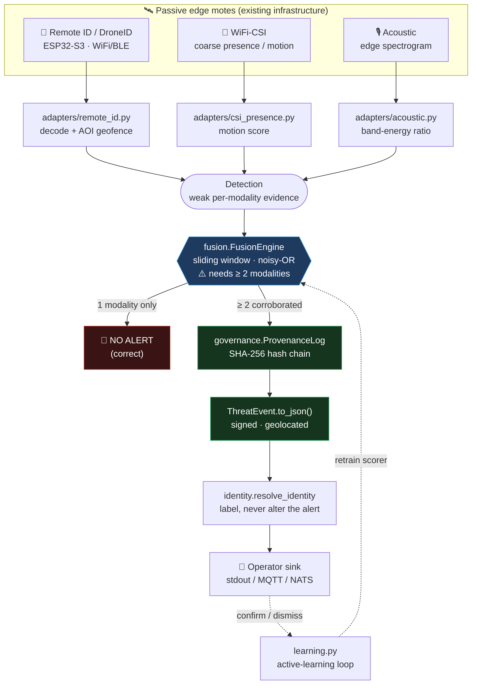

# RudeStorm

[](https://opensource.org/licenses/MIT)
[](https://www.python.org/)
[](#-usage)
[](#-features)

Passive urban-sensing **fusion middleware** that turns a city's *existing* wireless and IoT fabric into a single corroborated event stream — no new primary sensors deployed.

> We don't sell you sensors. We turn the city you already have into one.

Built for the DND/CAF IDEaS Component 1a challenge — *"Turning Urban Data into Real-Time Insight through AI."*

## 📌 Table of Contents
* [Features](#-features)
* [How It Works](#-how-it-works)
* [Installation](#%EF%B8%8F-installation)
* [Usage](#-usage)
* [The One Rule That Matters](#-the-one-rule-that-matters)
* [Privacy by Design](#-privacy-by-design)
* [License](#-license)

## ✨ Features
* **Passive-only fusion:** Three weak modalities in — passive Remote ID / DroneID, WiFi-CSI presence, acoustic — one high-confidence event out. The value is the *fusion*, not any single sensor.
* **False-alarm suppression:** No lone modality can raise an alert. A high-priority event requires **≥ 2 independent modalities corroborated in one time window**.
* **Privacy by design:** Face/plate redaction runs *inside* the edge node; raw pixels never leave it. Every decision is written to a tamper-evident SHA-256 hash chain.
* **Honest identity triage:** Confirmed drone events are labelled `IDENTIFIED` / `UNIDENTIFIED` / `IDENTITY_UNAVAILABLE` — receiver failure is never promoted into threat evidence.
* **Learns on-site:** numpy-only calibration, learned fusion, and per-node CSI baselining improve the false-alarm rate the longer it runs — without ever overriding the ≥ 2-modality safety rule.
* **Offline & edge-native:** Zero network calls at import; runs on Jetson-class / municipal hardware, because the jamming that kills a drone's C2 link could kill your backhaul too.

## 🧩 How It Works

Three passive signal streams are normalized by per-modality adapters, correlated in a time-aligned sliding window, hash-chained for chain-of-custody, and emitted as operator-ready JSON.



| Layer | Modality | Role | Honest limit |
|---|---|---|---|
| **AIR** | Passive Remote ID / DroneID | Locates drone + operator | Cooperative broadcasters only; encrypted/dark drones out of scope |
| **GROUND** | WiFi-CSI presence | Coarse presence / gross motion | No identity, pose, count, or vitals — ever |
| **CORROBORATION** | Acoustic spectrogram | Supporting vote | 8–15% urban FP rate → never alerts alone |

## 🛠️ Installation

```bash
# Clone the repository
git clone https://github.com/P1rate5ec/RudeStorm.git

# Navigate into the project folder
cd RudeStorm

# Install dependencies
pip install -r requirements.txt
```

## 💡 Usage

```bash
# Run three synthetic scenarios end-to-end
python -m rudestorm.demo

# Run the test suite
pytest -q
```

The demo shows the two behaviours that matter: a lone drone-like sound produces **no alert**, while corroborated modalities produce a signed, geolocated event.

```python
from rudestorm.pipeline import Pipeline
from rudestorm.adapters import RemoteIDAdapter, AcousticAdapter

pipe = Pipeline()
pipe.register(RemoteIDAdapter("mote-rf-1"))
pipe.register(AcousticAdapter("mote-mic-1"))

events = pipe.ingest("remote_id", "mote-rf-1", remote_id_frame)   # weak evidence, no alert
events = pipe.ingest("acoustic",  "mote-mic-1", audio_frame)      # corroborated → ThreatEvent
```

## 🔒 The One Rule That Matters

**No single passive modality raises an alert.** A high-priority event requires **≥ 2 independent modalities corroborated inside one time window** (`FusionConfig.min_modalities`). Acoustic and vibration are corroboration-only and can never stand up an event by themselves. This is the false-alarm-suppression story, and it satisfies the challenge's "≥ 2 heterogeneous sources" essential outcome.

## 🛡️ Privacy by Design

* **Edge redaction** (`governance.EdgeRedactor`) — face/plate blur runs inside the node; raw pixels never egress, only redacted metadata does.
* **Hash-chained provenance** (`governance.ProvenanceLog`) — every detection, correlation, and redaction is appended to a tamper-evident SHA-256 chain. `verify()` fails if any record is edited or removed.

## 📄 License

Distributed under the MIT License. See `LICENSE` for more information.

The CSI signal-processing chain is distilled from the reusable parts of the open-source `wifi-densepose` project, with its pose/vitals modelling removed — this system reports presence/motion only.
